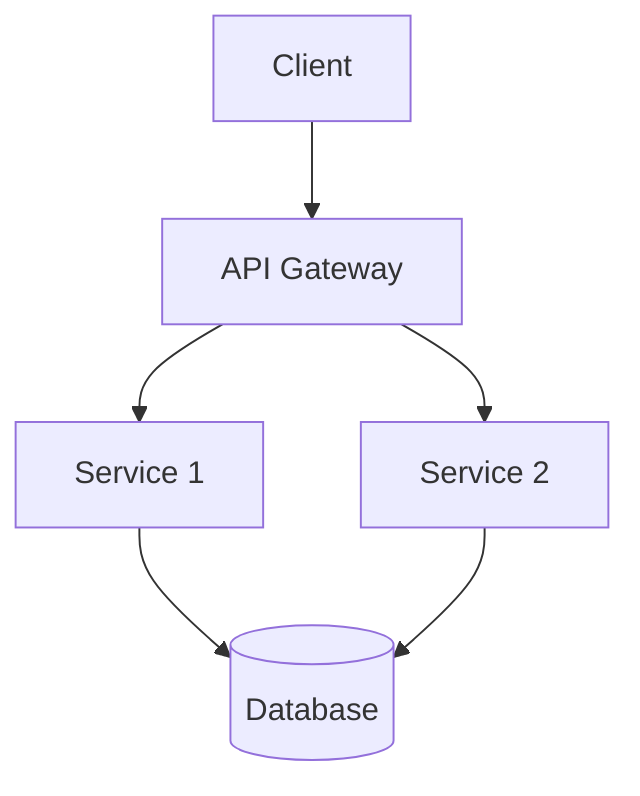

# Project Name

Brief description of what your project does.

## Features

- Key feature 1
- Key feature 2
- Key feature 3

## Architecture

### System Components


### Technical Stack
- Frontend: React, TypeScript
- Backend: Node.js, Express
- Database: PostgreSQL
- Cache: Redis
- Message Queue: RabbitMQ

### Data Flow
1. Client request flow
2. Authentication process
3. Data processing steps
4. Storage procedures
5. Response handling

### Security Measures
- JWT Authentication
- Rate Limiting
- Data Encryption
- Input Validation

## Installation

```bash
npm install your-package-name
# or
yarn add your-package-name
```

## Usage

```javascript
const package = require('your-package-name');

// Example usage code
package.doSomething();
```

## API Reference

### function1(param)

Description of function1.

**Parameters:**
- `param` (Type): Description

**Returns:**
- (Type): Description

## Configuration

```json
{
  "key": "value",
  "setting": true
}
```

## Contributing

1. Fork the repository
2. Create your feature branch (`git checkout -b feature/amazing-feature`)
3. Commit your changes (`git commit -m 'Add amazing feature'`)
4. Push to the branch (`git push origin feature/amazing-feature`)
5. Open a Pull Request

## License

This project is licensed under the MIT License - see the [LICENSE](LICENSE) file for details.

## Acknowledgments

- Person/library/resource that helped
- Inspiration
- etc.
